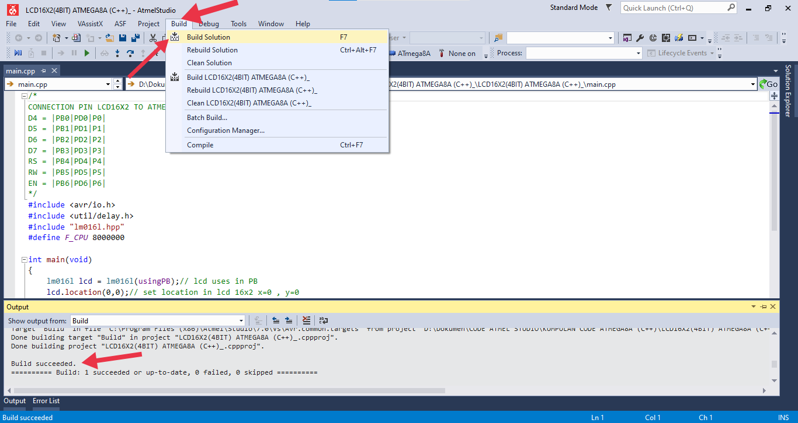
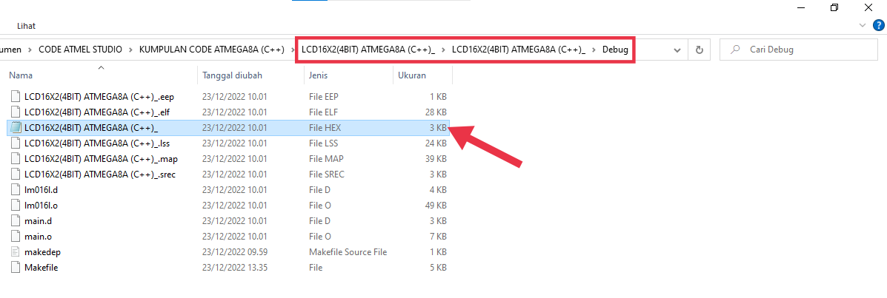

# EXPLANATION
This project contains a library to program 4 bit mode LCD16x2 and Atmega8a with (c++) language
# SOFTWARE USED
- Atmel Studio 7    = Code Editors
- Proteus           = Circuit Simulation  
# HOW TO CREATE A PROJECT AT ATMEL STUDIO
- Click new project

- Select GCC C++ Executable Project, Write a name in the white box, then click OK

- Type ATMEGA8A in the white box, then select ATmega8A in blue, then click OK

- Select Properties

- Select Toolchain, then select the Symbol in AVR/GNU C++ Compiler, then click the plus sign

- Type F_CPU=8000000 in the white box, then click OK\

- Click the close sign

- Right click on mainA.cpp, then click remove

- Click Delete

- Click the blue one, then click Add, then click Existing Item

- Go to the location of the files that have been downloaded, then select all, then click Add

- The code editor is ready to run

- Click Build, then click Build Solution or you can press F7, then there is a Build succeeded message which means the program has no problems

- After the build solution, open the location of the atmel studio code file, go to debug, a blue hex file will appear. This file will be programmed
into the microcontroller

# HOW TO MAKE A SIMULATION IN PROTEUS
- Click Open Project

- Select the LCD16X2 (4BIT) ATMEGA8A file, then click Open

- Right-click the ATMEGA8 pad, then click Edit Properties

- Click on the option (0100) Int. RC 8Mhz

- Click on Program Files

- Then select the atmel studio hex file, then click Open
